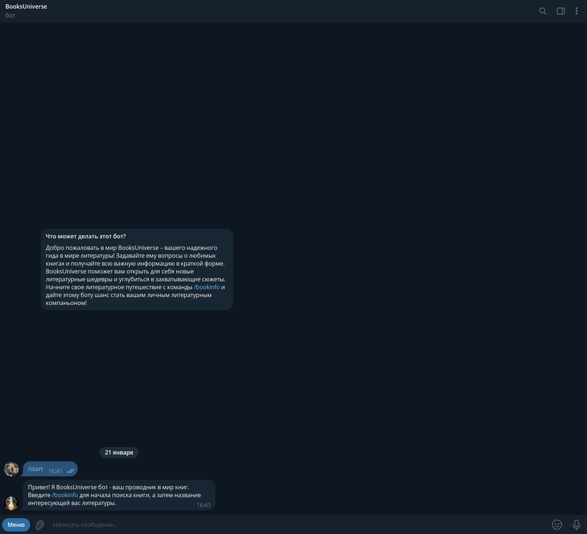
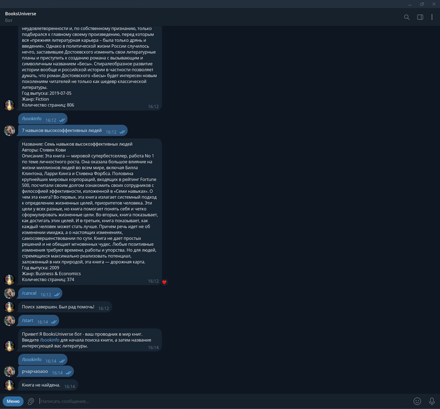

# BooksUniverse 
## Описание
Данный телеграмм-бот предоставляет пользователю удобный доступ к информации о литературных произведениях.
## Ключевые особенности
- Поиск книг по названию.
- Получение краткой информации о найденных книгах.
Бот использует внешние данные из публичного API Google Books для предоставления информации о книгах. Пользователю необходимо ввести команду /bookinfo и название интересующей их книги.
## Используемые команды
- /start: запускает обработчик команды start, который выводит приветственное сообщение и предлагает начать поиск книги.
- /bookinfo: запускает обработчик команды book_info, который предлагает пользователю ввести название книги для получения информации.
- /cancel: запускает обработчик команды cancel, который завершает поиск и выводит сообщение о завершении.
## Пример работы бота

